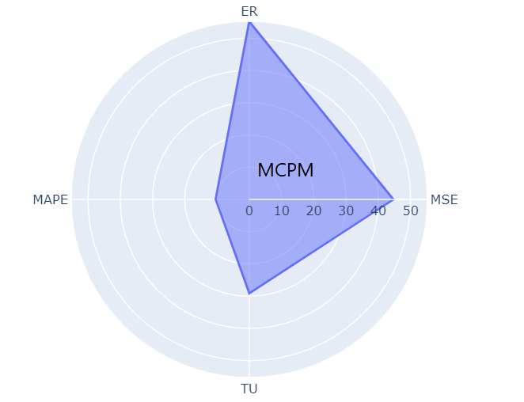
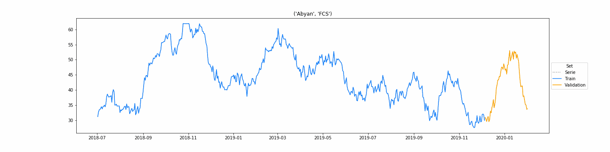
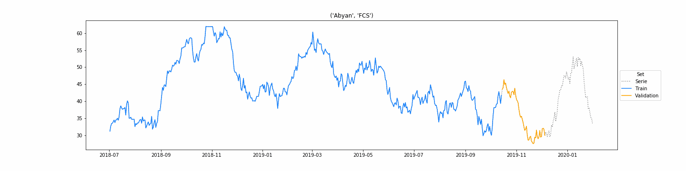

# Univariate-Forecasting

In this part of forecast analysis, we only consider univariate time-series: if we want to predict the FCS time-series of the provinces of the Yemen country, this forecast approcah treats each adminstrata time-series separately from the others and it try to forecast the time-series using different models. It is important and useful to test *simple forecast strategies* prior to testing more complex models. Simple forecast strategies are those that assume little or nothing about the nature of the forecast problem and are fast to implement and calculate. The results can be used as a *baseline in performance* and used as a *point of a comparison*. If a model can perform better than the performance of a simple forecast strategy, then it can be said to be skillful. Machine learning and deep learning methods can achieve impressive results on challenging time-series forecasting problems. Nevertheless, there are many forecasting problems where classical (statistical) methods readily outperform more sophisticated methods. Therefore, it is important to both understand how classical time-series forecasting methods work and to evaluate them prior to exploring more advanced methods [1].

We explore several univariate forecasting algorithms (some created using python packages already implemented (we'll denote these models with [-p]) and other built by hand [-h]):

- Naive mode [-h];
- Simple Moving Average model (SMA) [-h];
- Simple Exponential Smoothing (SES) [-h];
- Holt's Exponential Smoothing (HES) [-h];
- Holt-Winters' Seasonal Exponential Smoothing (HW) [-h];
- Autoregressive (AR) [-p];
- Moving Average (MA) [-p];
- Autoregressive Integrated Moving Average (ARIMA) [-p];
- kNN-TSPI [-h];
- Support Vector Machine (SVM) [-p];
- MLP [-p];
- LSTM [-p];
- CNN-LSTM [-p];

All this models are implemented to forecast a desired amount of future points h (prediction horizon) in a recursive (or similar) way. This means that the models are provided for the needing to predict h points ahead in time starting "today"!

[1] ["Evaluation of statistical and machine learning models for time series prediction: Identifying the state-of-the-art and the best conditions for the use of each model"](https://www.sciencedirect.com/science/article/pii/S0020025519300945), Antonio Rafael Sabino Parmezan, Vinicius M.A. Souza, Gustavo E.A .P.A . Batista.

## Basic metrics

In order to tune the hyperparameters (grid search analysis) and to compute the generalisation error to compare model performances, we present some basic metrics adopted to evaluate the forecast error. The most common metrics are the following denoting with  the actual value observed and with  the predicted value (for all these metrics lower values correspond to a better predictive performance for an algorithm):

- Mean Squared Error (MSE):

- Theil's U (TU) coefficient:

- Error Rate (ER):

where:  if  0"> &  otherwise.

- Mean Absolute Percentage Error (MAPE):

- Multi-Criteria Performance Measure (MCPM): 

## Evaluation protocols

As mentioned, an important consideration regarding the search of the best forecast algorithm is the selection of the best techniques for parameter estimation. In fact, one of the main difficulties faced by researchers in the time-series prediction is the search for the best parameter setting to fit a model according to a dataset. Next, we present the main parameter estimation methods for time-series prediction used in this section:

- Holdout validation:

- K-fold cross validation (an example of a FCS time-serie with 3 folds):

- K-fold cross validation (sklearn approach) (an example of a FCS time-serie with 3 folds):

N.B. these time-series examples doesn't have the test part that which has already been previously excluded! For the MLP, CNN and CNN-LSTM models an own validation approach is provided unlike the others.

