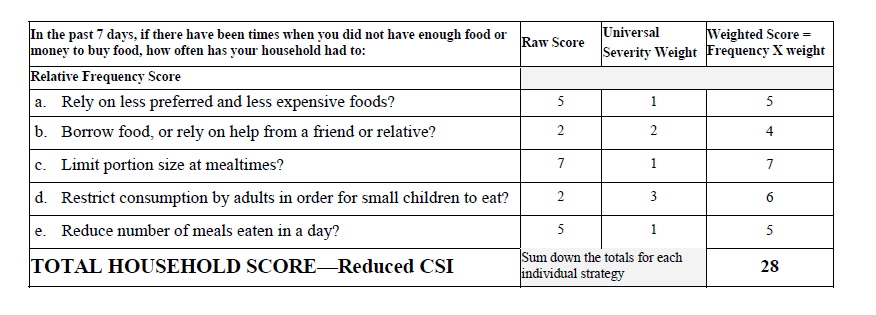

# Reduced-Coping-Strategy-Index

The Coping Strategy Index (CSI) is a proxy indicator for rapid measurement of household food security, as described in the related website provided by WFP [1]. Like for the FCS indicator, also the CSI is collected from household telephone surveys in several African and Asian countries. The CSI is based on household responses to a single question: *What do you do when don't have adeguate food, and don't have the money to buy food in the last 7 days?* The CSI combines the frequency of each strategy and their severity. 

The Reduced Coping Strategy Index (rCSI) is a reduced version of the CSI indicator due to the fact that the survey is conducted analyzing only 5 coping strategies. This standardization helps to generalize the survey to more countries. Each of these strategies has an own severity weight in order to set a level of risk correlated to the adoption of that strategy. An example of rCSI estimation is shown in Figure 1.

  

Figure 1

[1]. https://resources.vam.wfp.org/data-analysis/quantitative/food-security/the-coping-strategy-index

## Folder structure

- *wfp_data*: this folder contains the rCSI raw data provided by WFP;
- *rCSI.ipynb*: this jupyter notebook analyzes the rCSI raw data and consequently creates related time-series;
- *output_timeseries*: this folder contains all the rCSI time-series created by the rCSI.ipynb notebook;
- *CSI.pdf*: the technical guidance sheet of the CSI provided by WFP;
- *images*: this folder contains some images to visualize into the README.md file.