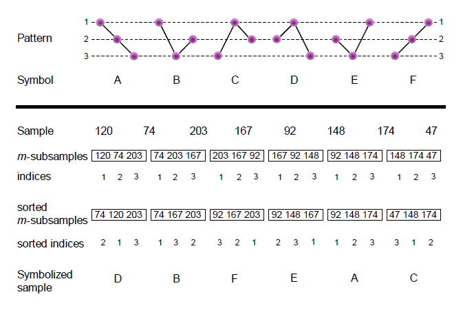

# Symbolic-Transfer-Entropy

There are several tools (e.g. Granger causality, lagged cross-correlation) that can be used to test statistical causality across the time-series. Here, we characterize the information flow between the signals through the transfer entropy. It quantifies the directional flow of information between pairs of time-series. This measure is applied in several research areas such as social media, medicine and economy. 

Schindler shows as the transfer entropy is equivalent to Granger causality for Gaussian processes. In the article, the authors analyze some advantages of the transfer entropy over the Granger causality. Among them all, the fact that the transfer entropy can capture non-linear causalities. 

There are several techniques for estimating the transfer entropy from observed data in order to apply it to real-world data problems. However, most of them require a large amount of data, and consequently, their results are commonly biased due to small-sample effects, which limits the use of transfer entropy in practical data applications. To avoid this problem, we use the robust and computationally fast technique of symbolization to estimate the transfer entropy, the so-called \textbf{symbolic transfer entropy}. It simply computes the transfer entropy between pairs of time-series by first categorizing the signals in a small set of symbols or alphabet according to their trends.

## Symbolization procedure

The first stage of the STE converts a continuous time series $X$ into a sequence of discrete symbols $\hat{X}$ by adopting a permutation technique. Let $x(i)$ $i = 1, ..., N$ denote sequences of observations from systems $X$. For a given, but otherwise arbitrary $i$, $m$ amplitude values $X_i=\{x(i),x(i+\tau),…,x(i+(m-1)\tau)\}$ are arranged in an ascending order where $\tau$ denotes the time delay, and $m$ is the embedding dimension. In the unlikely case of equal amplitude, the observations are ordered according to their original index. Therefore, each $X_i$ is mapped onto one of the $m!$ possible permutations. 

 

 
Let's suppose to have a test time-series $X = \{120, 74, 203, 167, 92, 148, 174, 47\}$ and to transform it into a symbolic sequence. For simplicity, let's take the embedding dimension $m=3$ and $\tau = 1$. This quantity determines the amount of symbols that can possibly exist, more precisely $m!$. The first step to transform $X$ into a symbolized time-series is to slide a window of length $m$ over the time-series. So, we start taking the first three elements of $X$ and we sort them in increasing order, which leaves us with $\{74, 120, 203\}$. Now, we keep tract of these values' indices, such that the sequence looks like $\{2, 1, 3\}$. This first subchain maps to symbol $D$. From this scheme, we just need to advance the window one value at a time: the next subchain to consider is $\{74, 203, 167\}$. Its sorted version is $\{74, 167, 203\}$ which corresponds to $\{1, 3, 2\}$ pattern, and maps to $B$. And so on, until to achieve the final symbolic sequence $\hat{X} = \{D, B, F, E, A, C\}$. See in the Figure the complete illustration of the symbolization steps. 

The embedding dimension $m$ and the time delay $\tau$ are to be set in order to derive a reliable state space. There exist different procedural approaches in order to deal with this setting decision. Setting $m = 2$ yields merely few permutations, which affects the statistical significance of the measure as an excessive amount of information about the system's inherited dynamic is being ignored. Conversely, the condition $N > (m!)^3$ has to be satisfied, where $N$ denotes the length of the time series observed. This assures the occurrence of every possible joint
permutation pattern. Bandt and Pompe suggest to work with an embedded dimension of $3 \leq m \leq 7$ and
chose $\tau = 1$. Thus, $m = 3$ was selected for the calculation of STE in the following analyses in order to comply with these conditions.

An important convenience of symbolic approaches is that they discount the relative magnitude of the time-series. This is important in our case because different geographical units can differ largely in population density or other parameters. Moreover, this approach means that it is possible to successfully analyze time-series which may be short and/or non-stationary. 

The main disadvantage of the symbolic approaches is that it only focuses on the
sequential structure and ignores the degree of difference between the amplitude values of the time-series. Therefore, the influence of large fluctuations in the time series on the final results of the transfer entropy is not considered. On the other hand, the small fluctuations which may be induced by noise should not be supposed to exert the same influence on the final STE value as the large fluctuations. In recent times, different approaches have emerged to deal with these problems. One of them is the work proposed by Zhaohui Li et all. that defines a weighted version of the symbolic transfer entropy in order to deal with the difference in amplitude of the various permutations. 

## Transfer Entropy

Let $\hat{x}_i = \hat{x}(i)$ and $\hat{y}_i = \hat{y}(i)$, $i = 1, ..., N$, denote sequences of observations from systems $\hat{X}$ and $\hat{Y}$ (symbolized time-series). The transfer entropy incorporates time dependence by relating previous samples $\hat{x}_i$ and $\hat{y}_i$ to predict the next value $\hat{x}_{i + 1}$, and quantifies the deviation from the Markov property, $p(\hat{x}_{i + 1}|\hat{x}_i, \hat{y}_i) = p(\hat{x}_{i + 1}|\hat{x}_i)$, where $p$ denotes the transition probability density. If there is no deviation from the Markov property, $\hat{Y}$ has no influence on $\hat{X}$. Transfer entropy, which is formulated as Kullback-Leibler entropy between $p(\hat{x}_{i + 1}|\hat{x}_i, \hat{y}_i)$ and $p(\hat{x}_{i + 1}|\hat{x}_i)$, quantifies the incorrectness of this assumption, and is explicitly non-symmetric under the exchange of $\hat{x}_i$ and $\hat{y}_i$. The main convenience of such an information theoretic functional designed to detect causality is that, in principle, it does not assume any particular model for the interaction between the two systems of interest.

Now, we can obtain the pairwise transfer entropy computing the joint and conditional probabilities of the sequence indices from the relative frequency of symbols in each sequence, $\hat{X}$ and $\hat{Y}$, using the following formula:

\begin{align}
\begin{split}
 T_{XY} = \sum p(\hat{y}_{i + \delta}, \hat{y}_{i}, \hat{x}_{i}) log_2\Big(\frac{p(\hat{y}_{i + \delta}| \hat{y}_{i}, \hat{x}_{i})}{p(\hat{y}_{i + \delta}| \hat{y}_{i})}\Big) =
\\
 = \sum p(\hat{y}_{i + \delta}, \hat{y}_{i}, \hat{x}_{i}) log_2\Big(\frac{p(\hat{y}_{i + \delta}, \hat{y}_{i}, \hat{x}_{i}) p(\hat{y}_i)}{p(\hat{y}_i, \hat{x}_i) p(\hat{y}_{i + \delta}, \hat{y}_{i})}\Big)
\end{split}
\label{eq:eq8}
\end{align}

where the sum runs over each unique state of the sequences. The lag separating the two time samples of interest is referred to as $\delta$. $T_{XY}$ (or better $T_{X \rightarrow Y}$) measures the information flow from $X$ to $Y$. It is non-negative, and any information transfer between the two variables results in $0 \leq {T}_{XY} < \infty$. If the state $\hat{x}_{i}$ has no influence on the transition probabilities from $\hat{y}_{i}$ to $\hat{y}_{i + \delta}$, or if the two time series are completely synchronized, then ${T}_{XY} = 0$. The logarithm has base 2, so that the transfer entropy is measured in bits. For example if $T_{X, Y} = 0.24$ means that the history of the $X$ process has $0.24$ bits of additional information for predicting the next value of $Y$ (i.e., it provides information about the future of $Y$, in addition to what we know from the history of $Y$). Since it is non-zero, you can conclude that $X$ influences $Y$ in some way. There are actually two equations for the transfer entropy, because it has an inherent asymmetry in it:

\begin{equation}
T_{YX} = \sum p(\hat{x}_{i + \delta}, \hat{x}_{i}, \hat{y}_{i}) log_2\Big(\frac{p(\hat{x}_{i + \delta}, \hat{x}_{i}, \hat{y}_{i}) p(\hat{x}_i)}{p(\hat{x}_i, \hat{y}_i) p(\hat{x}_{i + \delta}, \hat{x}_{i})}\Big)
\end{equation}

We can obtain the matrix $\{T_{XY}\}$, which contains pairwise information about how each component in the system controls (or is controlled by) the others. The matrix $\{T_{XY}\}$ is asymmetric. 

The transfer entropy for two simbolic time-series can be also derived using conditional Shannon entropies by expanding the logarithm:

\begin{equation}
T_{XY} = H(\hat{y}_{i + \delta}|\hat{y}_{i}) - H(\hat{y}_{i + \delta}|\hat{y}_{i}, \hat{x}_{i})
\end{equation}

where $H(\hat{y}_{i + \delta}|\hat{y}_{i}) = -\sum p(\hat{y}_{i + \delta}, \hat{y}_{i}) log_2(p(\hat{y}_{i + \delta}| \hat{y}_{i}))$ is the entropy rate (a conditional Shannon entropy) and similarly $H(\hat{y}_{i + \delta}|\hat{y}_{i}, \hat{x}_{i})$ a generalised entropy rate. The entropy rate $H(\hat{y}_{i + \delta}|\hat{y}_{i})$ accounts for the average number of bits needed to encode one additional state of the system if the previous states is known, while the entropy rate $H(\hat{y}_{i + \delta}|\hat{y}_{i}, \hat{x}_{i})$ is the entropy rate capturing the average number of bits required to represent the value of the next destination’s state if source state is included in addition. Since one can always write:

\begin{equation}
H(\hat{y}_{i + \delta}|\hat{y}_{i}) =  -\sum p(\hat{y}_{i + \delta}, \hat{y}_{i}) log_2(p(\hat{y}_{i + \delta}| \hat{y}_{i})) = 
-\sum p(\hat{y}_{i + \delta}, \hat{y}_{i}, \hat{x}_{i}) log_2(p(\hat{y}_{i + \delta}| \hat{y}_{i})) \\
\end{equation}

It is easy to see that the entropy rate $H(\hat{y}_{i + \delta}|\hat{y}_{i})$ is equivalent to the rate $H(\hat{y}_{i + \delta}|\hat{y}_{i}, \hat{x}_{i})$ when the next state of destination is independent of the source:

\begin{equation}
p(\hat{y}_{i + \delta}|\hat{y}_{i}, \hat{x}_{i}) = p(\hat{y}_{i + \delta}|\hat{y}_{i})
\end{equation}

Thus, in this case the transfer entropy reduces to zero.

Finally, we can define the information entropy that is transferred from $\hat{X}$ to $\hat{Y}$ at some later points in time can be defined as:

\begin{equation}
T_{XY} = T_{XY}^{\delta'}, \ \ \delta' = \underset{\delta}{\mathrm{argmax}} \  T_{XY}^{\delta}
\end{equation}

In this equation, $T_{YX}$ is defined in a complete analogy.

The dominant direction of the information flow can be inferred by calculating the difference between $T_{YX}$ and $T_{XY}$. It is convenient to define the directionality index $T_{XY}^{S} = T_{YX} - T_{XY}$, which measures the balance of information flow in both directions. This index quantifies the dominant direction of information flow and is expected to have positive values for undirectional couplings with $x$ (x-axis) as driver and negative values if $y$ (y-axis) is driving $x$. For symmetric bidirectional couplings, we expect $T_{XY}^{S}$ to be null. 