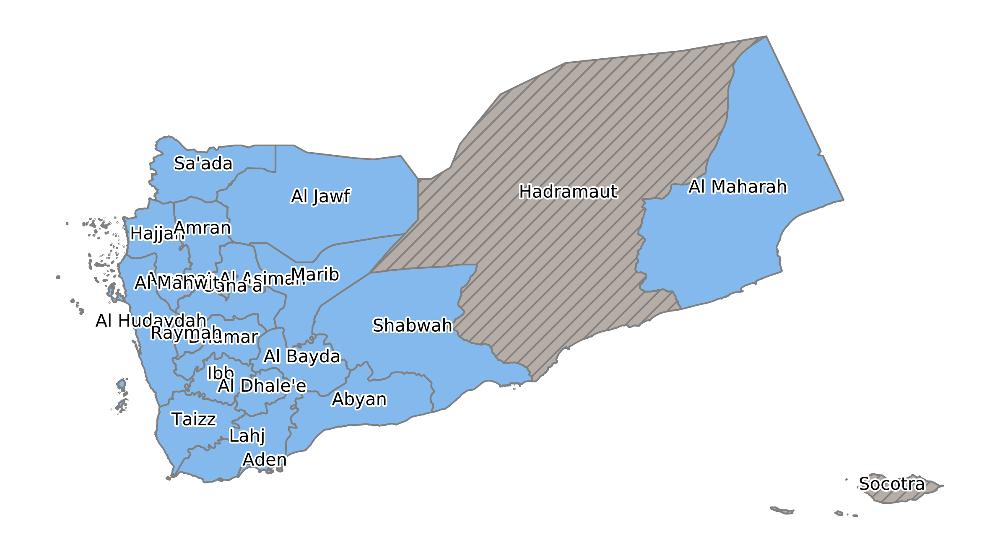
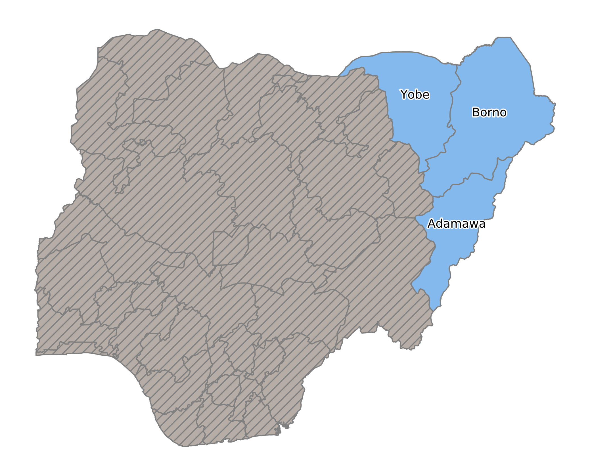
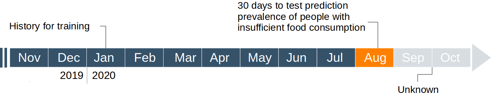
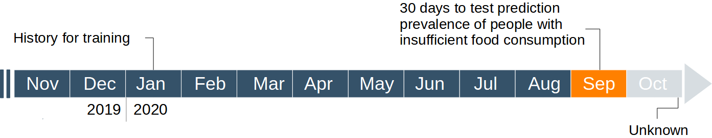
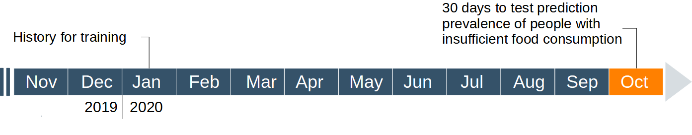

# Yemen + Nigeria

Into this folder, we store all the analysis regarding the time-series forecasting using the XGBoost model. In particular, we want to predict 30 days ahead in the future of the prevalence of people with insufficient food consumption in some administartive regions of Yemen and Nigeria:

XGBoost algorithm deals with supervised machine learning tasks, like classification and regression. In this regard, the time-series forecast process must be adapted to the regression setup. Since the concerned configuration does not support a multi-output design, we employ 30 different regression models in order to cover all our prediction horizons.

The effectiveness of the forecasting algorithm is based on the results of the predictions in the administrative regions. Assuming we keep the last points of our time-series as our model evaluation, our three sets would not be representative of the whole dataset, inducing bias on the model, and error estimates. A more robust solution is offered by the k-fold cross-validation, but in a time-ordered way. In this manner, the evaluation looks at different historical periods ensuring greater generalizability. In our work, we adjust this technique in order to easily interpret results in understanding the possibility of releasing a real application. 

In the case of Yemen + Nigeria country, we evaluate the goodness of the forecasting over the following 5 periods: 

 - Split 1: the range of days to predict the prevalence of people with insufficient food consumption is 2020-08-01 - 2020-08-30.
 

 
 - Split 2: the range of days to predict the prevalence of people with insufficient food consumption is 2020-09-01 - 2020-09-30.
 

 - Split 3: the range of days to predict the prevalence of people with insufficient food consumption is 2020-10-01 - 2020-10-30.
 

 
 
The forecasting procedure begins with converting our time-series data into pairs of input features (X) and output targets (y). The decision algorithm learns from this data to identify food insecurity behavior over time. In the process, the training is enhanced through different strategies, like hyper-parameter tuning. For this reason, we also apply a model selection procedure that makes use of an additional part of training data for validation (10 % of training data for validation).

## Folders structure

We have divided the main analyzes of the project into several folders. For a correct navigation within the project, we recommend that you first run the code into the 'creator_train_test.ipynb' notebook (this notebook returns as output the creation of a folder 'data_xgboost' containing the input and output samples for each administrative region) and then the python file 'Hyperparameter_tuning.py' (this file returns as output the creation of a folder 'output_hyperparameter_tuning' containing all the results obtained from the hyperparameter selction (and not only)). Finally, you can run the 'test.ipynb' notebook that returns the results on test sets storing them into the 'output_test' folder.
