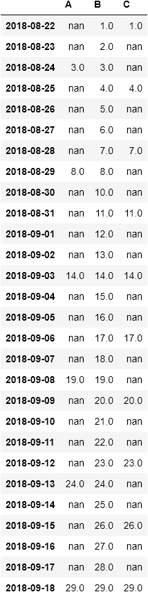

# Lags-Creator

This module allows to create lag-features samples for time-series forecasting purposes. The module supports different configurations to get the outputs into several formats. In order to correctly use this module, it is necessary to have a a pandas.DataFrame `df` with a single column level representing the time-series and a single index level representing a pandas.DatetimeIndex with an appropriate frequency set. For example, let's take the following dataframe `df`:

In this case, we have three time-series, `A`, `B` and `C`. Supposing we would like to predict 4 steps ahead in the future for the time-series `B`. The time-series `B` is therefore defined as our `target` feature. 

The main ingredient to be supplied to the initialization function of the LagsCreator class is a dictionary containing the information about the lag-features for each time-series. For example, setting the `lags_dict = {"A":  np.array([1, 3]), "B": np.array([1, 2, 3, 4, 5]), "C": np.array([1])}`, it means that the input samples extrapolated from the time-series `A` correspond to the first and third *available* lags starting from a reference date. Similar procedure for the other time-series. We use the word *available* beacause the nan values, when present, are discarded. For this reason, the collection of the input samples starts when it is possible to get a value for each provided lag of all the time-series in the corresponding history.

The first step is the initialization of the Lags-Creator class:

    creator = LagsCreator(df, lags_dictionary = lags_dict, target = "B", delay = False)

We can forecast multiple steps (e.g. 4 steps in the future) into a single-shot through a *direct approach* (in practice, we set `single_step = False` during the initialization of the `to_supervised` method of the Lags-Creator class). Now, we can create lag-features for each time-series present in the dataframe. The delay parameter simply allows to create an extra feature for each time-series corresponding to the delay from the reference date and the first value kept for each tim-series.

    X_train, y_train, X_test, columns_input = creator.to_supervised(h = 4, single_step = False)

We get the following samples: X_train (blue objects) and y_train (orange objects).

At the end of the iteration, we will have a set of samples: . 

If you don't want to use some time-series, you can set the corresponding 'lag value' in the dictionary to 'None'. Setting for example `lags_dict = {"A": None, "B": np.array([1, 2, 3, 4, 5]), "C": np.array([1])}`, we get:

Returning to consider the paramenter `lags_dict = {"A":  np.array([1, 3]), "B": np.array([1, 2, 3, 4, 5]), "C": np.array([1])}`, the module returns three numpy.array `X_train`, `y_train` and `X_test`:

As you can see, the arrays `X_train` and `y_train` contain the information of each input and output sample, showed in the corresponding gif, flatten into rows and then stored into a numpy.array. The `X_test` contains the last available input information to make prediction in the future: 

To better understand the outputs, it is possible to set (slower option) `return_dataframe = True` calling the `to_supervised` method of the LagsCreator class. In this manner, you can get the following `X_train` and `y_train` outputs:

X_train:

y_train: 

Moreover, it is possible to move the window with which the points are created to a step greater than 1, as it happens in the previous cases. The `step` parameter of the `to_supervides` method allows to set this slide to larger values.

As an alternative to the direct approach there is an approach that we call `single_step` where each prediction horizon is predicted independently of the others. So, setting `single_step = True`, and supposing we want to predict the 2-th day ahead in the future, we will have the following steps:

Using this last configuration, it is possible to to add some feature times to the input samples. This parameter has to be a list containing the time information you want to extract from data. The allowed values are: ["Day", "Month", "Year", "Dayofweek", "Week", "Quarter", "Weekofyear", "Dayofyear"]. For example: 

    creator = LagsCreator(df, lags_dictionary = lags_dict, target = "B")
    X_train, y_train, X_test, columns_input = creator.to_supervised(h = 2, single_step = True, return_dataframe = True, feature_time = ["Day", "Month", "Year"])
    
We get for the `X_train` output:
    

### Visualization

The LagsCreator class also provides a visualization function in order to better examine the samples created. In fact, it is also possible to show the gif of the rolling samples created (all the gif showed into this documentation are created through the visualization method of the LagsCreator class).
                                                                   
We can visualize the samples created using the `visualization` function:

    train, test = creator.visualization(boundaries = False, gif = True)
