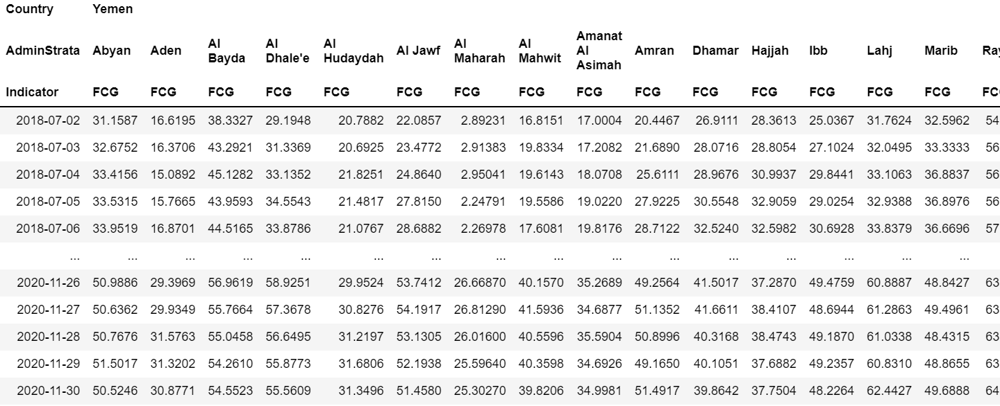
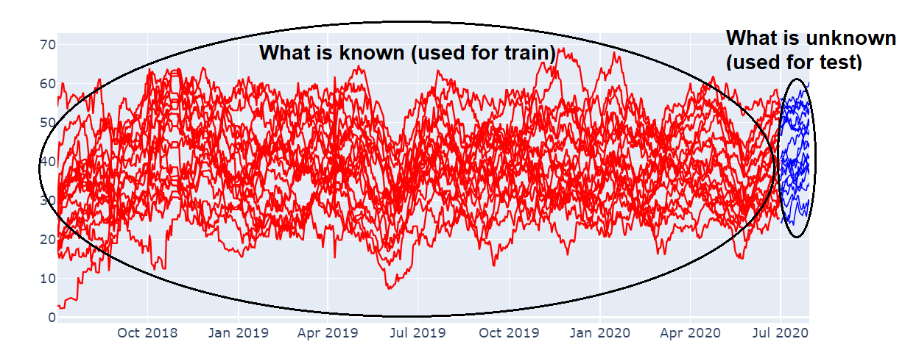
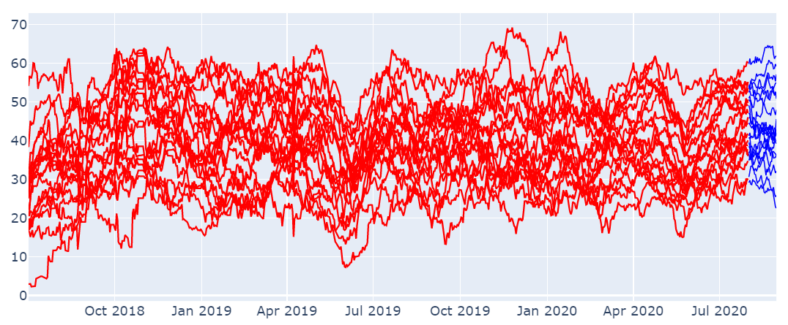
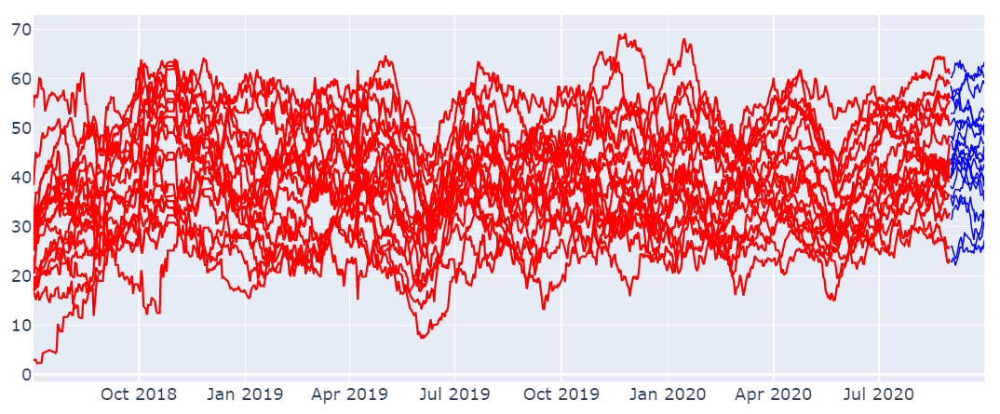
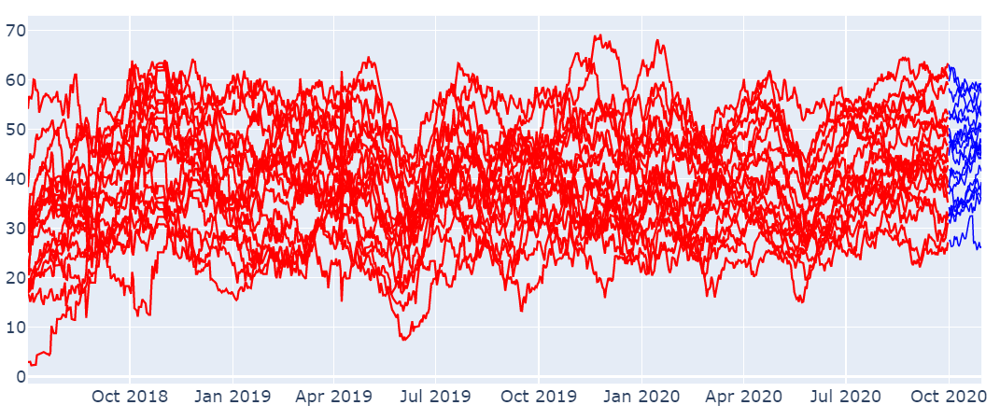
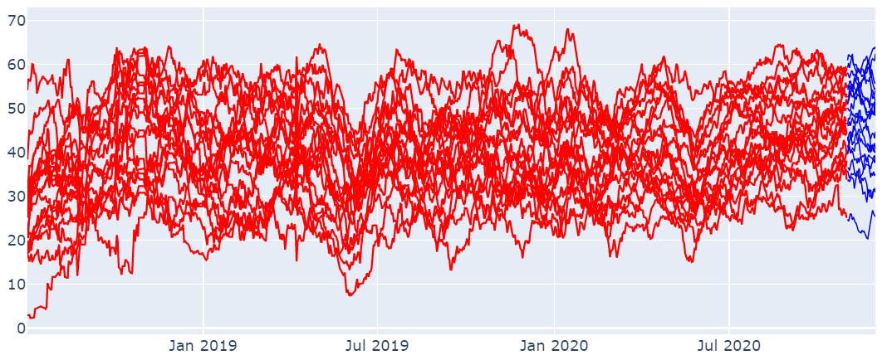

# Nested-Cross-Validation

This function splits a pandas dataframe containing single or multiple time-series into n splits (multiple dataframes) in order to perform a nested cross validation for time-series forecasting purposes. More specifically, the split is based on the end of the months up to the number of days you want to predict (in our case `test_size`=30). 

Supposing to have a dataframe `df`:

Our nested cross validation procedure works as follow:

    # Create the nested cross validation.
    cv = NestedCV(n_splits = 5, test_size = 30)
    # Nested cross validation.
    SPLITS = cv.get_splits(df)
    
The 5 splits are created backworks from last date availability, in this case the end of the month "2020-11-30":

Split 1: range of days to predict (blue) between 2020-07-01 - 2020-07-30

Split 2: range of days to predict (blue) between 2020-08-01 - 2020-08-30

Split 3: range of days to predict (blue) between 2020-09-01 - 2020-09-30

Split 4: range of days to predict (blue) between 2020-10-01 - 2020-10-30

Split 5: range of days to predict (blue) between 2020-11-01 - 2020-11-30

N.B. Ff the last available date had been for example 2020-11-19, then the month would have been discarded from the analysis if `test_size`=30 because not enough data (19 days) were present to cover 30 days.