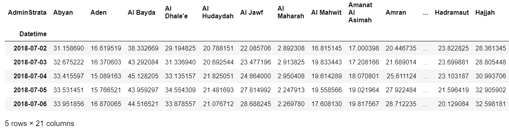
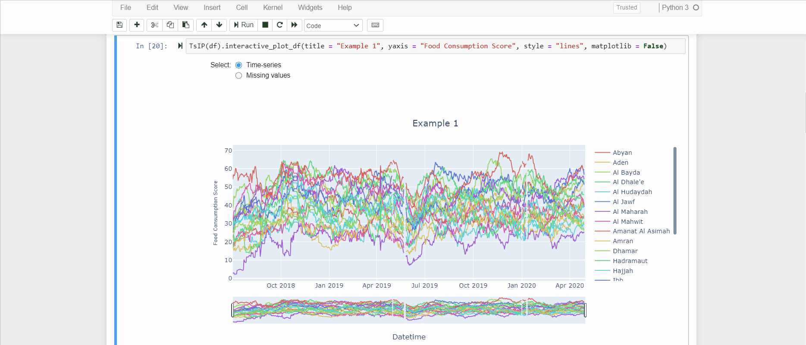
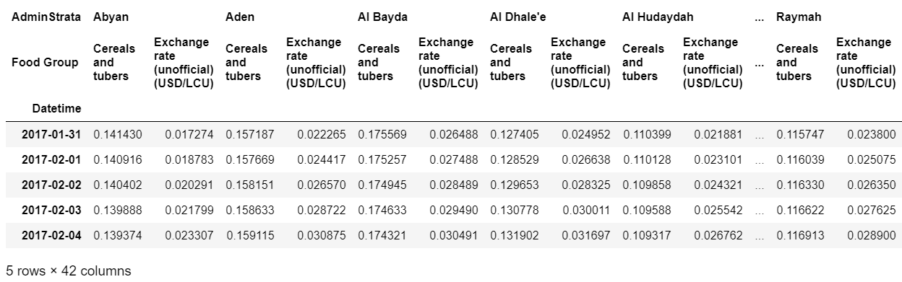
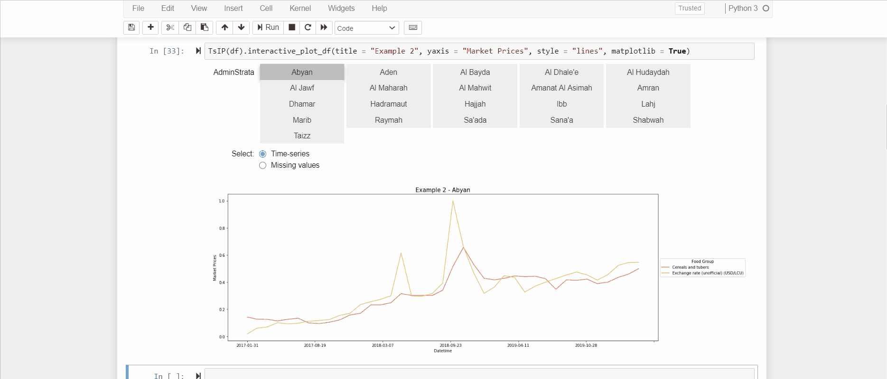
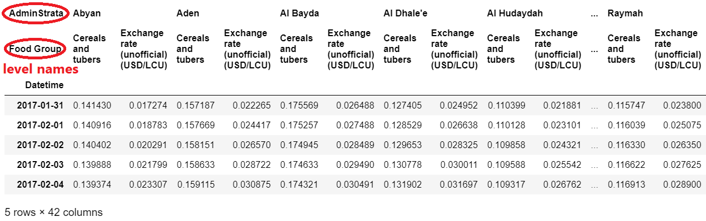
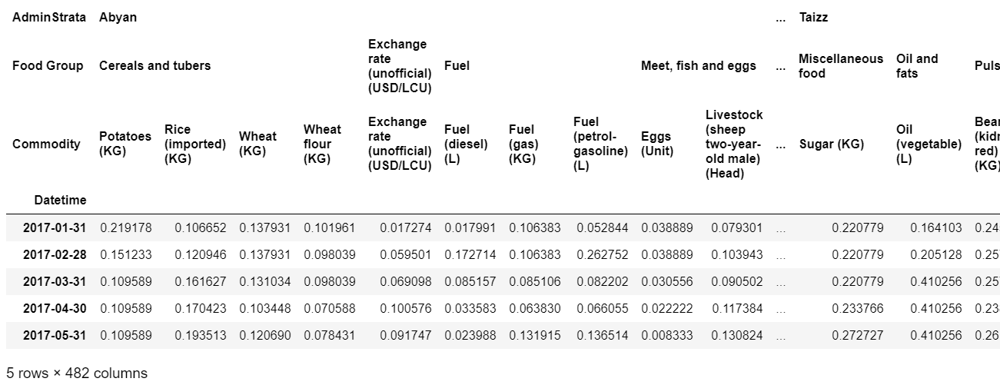
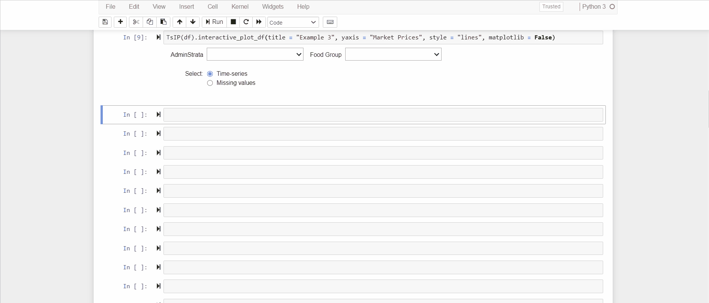
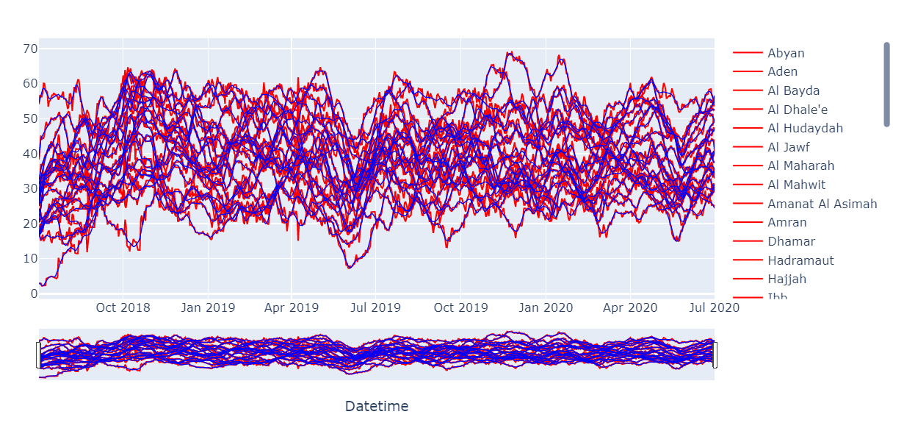

# TsIP

**TsIP** (**T**ime-**s**eries **I**nteractive **P**lot) is a python library developed to interactively visualize multiple time-series quickly and easily. 
The implementation of this tool addresses the need to visualize time-series stored into a pandas dataframe with hierarchical multi-index on axis 1, taking advantage of dynamic user interaction.
The time-series are plotted using either the *matplotlib* library or the *plotly* library (user will). For a more involving navigation within the time-series visualization, it is advice to use the plotly library rather than the matplotlib library.  

## Examples

1. Supposing to have a simple dataframe `df` with a single level on axis 1:

Using the TsIP library, we can easily visualize all the time-series with a simple command:

N.B. If `matplotlib = False`, the time-series are visualized using the plotly library which as you can see is much more engaging. Otherwise, a similar interactive plot is shown using the matplotlib library.

2. Supposing to have a dataframe `df` with two levels on axis 1:

We now visualize the time-series using the matplotlib library as example:

N.B. The TsIP module works fine if all the levels of the dataframe have set a name:

3. Supposing to have a dataframe `df` with three levels on axis 1:

Returning to visualize the time-series using the plotly library:

The TsIP module has the potential to manage dataframes that can have up to 4 levels on axis 1. 

Furthermore, it is also possible to compare the time-series that belong to two equal hierarchical dataframes.

The package also contains a further function to plot the predictions results obtained by a time-series forecasting algorithm.

