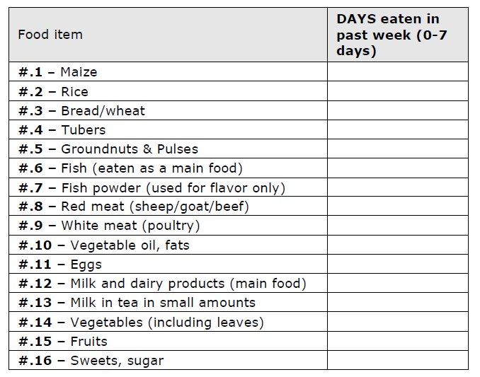
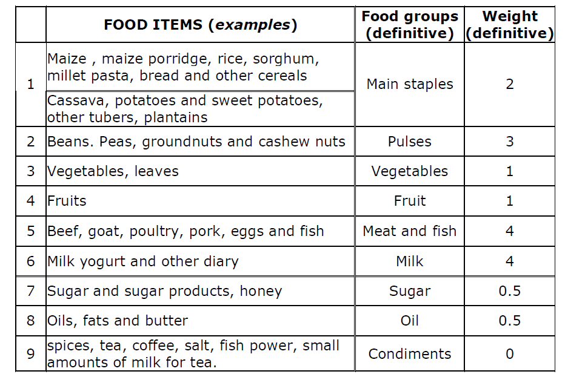

# Food-Consumption-Score

The Food Consumption Score is a proxy indicator for food security, as described in the related website provided by WFP [1]. The indicator is built by conducting household telephone surveys in several African and Asian countries by inspecting how often the households consume food items from different food groups during a 7-day reference period. The questionnaire that drives the survey looks like Figure 1 and it is conducted posing the following question: *I would like to ask you about all the different foods that your household members have eaten in the last 7 days. Could you please tell me how many days in the past week your household has eaten the following foods?*

<figure>
  
</figure>

**Figure 1**

At the end of the questionnaire, the food items are grouped into predefined food groups to which is assigned a reference weight based on the nutrient density of the corresponding foods (see Figure 2). All the consumption frequencies of the food items within the same group are first summed and then multiplied by their corresponding weights. Finally, the weighed food group scores are summed to get the **Food Consumption Score (FCS)**. All the calculation steps are summarized by the following formula:

\begin{equation}
 FCS_{household} = \sum_i^{Food \ groups} w_i \cdot \Big(\sum_j^{Food \ items} c_j^{(i)}\Big)_{|_7}
 \label{eq:fcs}
\end{equation}

where $c$ is the food item frequency and $|_7$ is the operator that resets to 7 the values above 7.

In practical terms, the FCS is a composite score based on dietary diversity, food frequency, and relative nutritional importance at household level. 

<figure>
  
</figure>

**Figure 2**

It is possible to classify the FCS score into three groups (Food Consumption Groups): poor, borderline, acceptable. The modus operandi to obtain this classification is through the cut-offs of 21 and 35 (in populations that have high frequency of consumption of sugar and oil the alternate cut-offs of 28 and 42 may be more appropriate): a household with the FCS score below 21 is classified as poor while a household with the FCS score above 35 as acceptable. 

[1]. https://resources.vam.wfp.org/data-analysis/quantitative/food-security/fcs-food-consumption-score

## Folder structure

- *wfp_data*: this folder contains the FCS raw data provided by WFP;
- *FCS.ipynb*: this jupyter notebook analyzes the FCS raw data and consequently creates related time-series;
- *output_timeseries*: this folder contains all the FCS time-series created by the FCS.ipynb notebook;
- *FCS.pdf*: the technical guidance sheet of the FCS provided by WFP;
- *images*: this folder contains some images to visualize into the README.md file.

