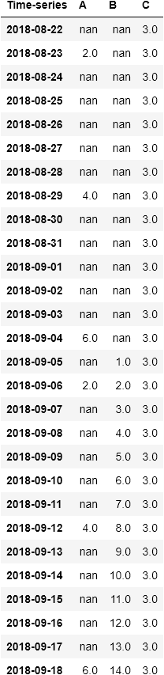
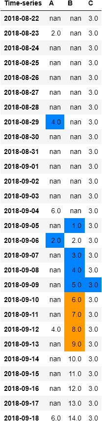
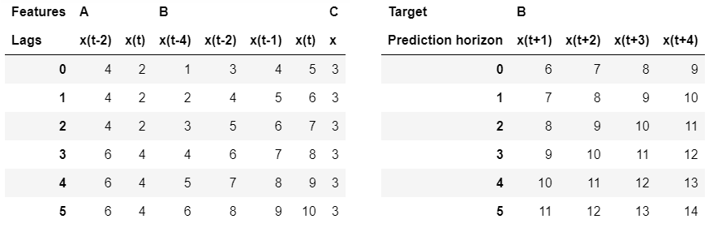
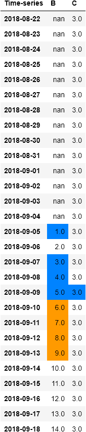
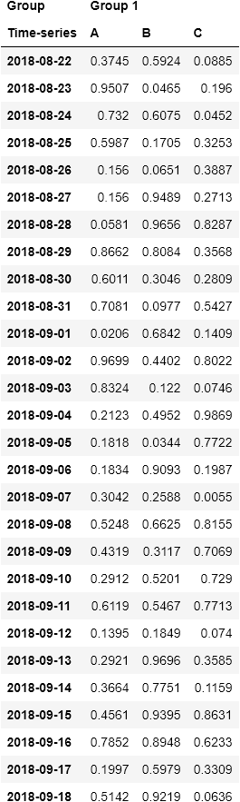
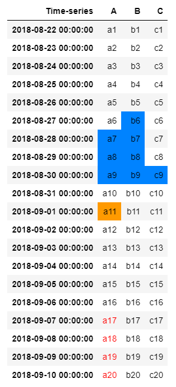

# Lags-Creator

This module allows us to create lag-features samples for time-series forecasting purposes. The module supports different configurations to get the outputs into several formats. In order to correctly use this module, it is necessary to have a pandas dataframe `df` with single/multiple columns representing the time-series. For example, let's take the following dataframe `df`:

N.B. The dataframe `df` need to have a pandas datetime index with an appropriate frequency set.

In this case, we have three features (time-series), `A`, `B` and `C`. Supposing we would like to predict 4 steps ahead in the future for the time-series `B`. The time-series `B` is therefore defined as our `target` feature. 

We can forecast multiple steps (e.g. 4 steps in the future) into a single-shot through a *direct approach* (in practice, we set `single_step = False` during the initialization of the Lags-Creator class). Now, we have to create lag-features for each time-series present in the dataframe. We then provide to the module the `lags_dictionary` parameter. It is a python dictionary containing the lag values for each time-series. 

E.g., setting the `lags_dictionary = {"A":  np.array([1, 3]), "B": np.array([1, 2, 3, 5]), "C": 0}`, we create the following training points:

At the end of the iteration, we will have a set of training points: . 

As seen, the algorithm works also for static time-series, in this case the value to set in the input dictionary is 0. Furthermore, if you decide to insert a None feature lag in the dictionary, the feature corresponding to that value is automatically discarded during the process for creating samples.

The module returns two numpy dataframes (arrays) `X` and `y` (`return_dataframe = True`) as training output. 

Moreover, it is possible to move the window with which the points are created to a step greater than 1, as it happens in the previous cases. The `step` parameter allows you to set this slide to larger values.

As an alternative to the direct approach there is an approach that we call `single_step` where each prediction horizon is predicted independently of the others. So, setting `single_step = True`, and supposing we want to predict the 2-th of 4 prediction horizons, we will have the following steps:

## Visualization

The LagsCreator module also provide a visualization function in order to better examine the samples created. Supposing to use the dataframe `df` and we create the following samples using the previous `lags_dictionary`.

Setting the following parameters:

    creator = LagsCreator(df["Group 1"], lags_dict, "B", return_dataframe = True)
    X_train, y_train = creator.to_supervised(h = 2, single_step = True)
                                                                   
Now, we can visualize the samples created using the `visualization` function:

    train = creator.visualization(boundaries = False)
    
If you want to see the 3-th training sample, we get it through the variable `train[2]`: 

It is also possible to show the gif of the rolling samples created (all the gif showed into this documentation are created through the visualization method of the LagsCreator class):

    train = creator.visualization(boundaries = False, gif = True)

