# Lags-Creator

This module allows to create *training/validation/test* lag-features for time-series forecasting. It supports several configurations that you can change to get the desired output format. The starting point for using this module is to have a dataframe `df` with two levels on axis 1: the level 0 corresponding to the main group and the level 1 corresponding to the time-series. For example, let's take the following dataframe:

N.B. The dataframe `df` need to have an appropriate pandas datetime index.

In order to better understand the functionality of the current module, let's flip the dataframe for explanation purposes only:

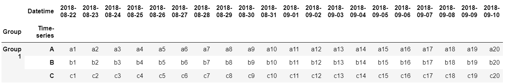

In this case, we have three features (time-series), `A`, `B` and `C`. Supposing we would like to predict 4 steps ahead in the future of the time-series `A`. The time-series `A` becomes our `target` feature. We can complete the prediction through a *direct approach*: we train a model to predict in one fell swoop 4 points in the future (in practice, we set `single_step = False`). Now, we have to create lag-features for each time-series present in the dataframe. We provide to the module the `lags_dictionary` parameter. It is a python dictionary containing the lag values for each time-series, e.g., `lags_dictionary = {"A": 5, "B": 5, "C": 5}`. In this manner, we create the following training points:

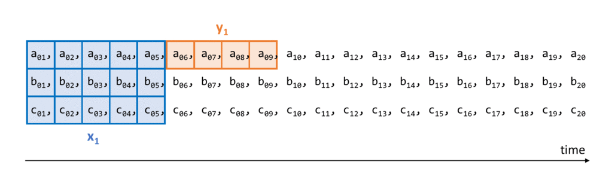

At the end of the procedure, we will have a set of training points . In practice, we will have as output two numpy arrays `X` and `y` of shapes respectively `(n_samples, timesteps, n_features)` and `(n_samples, n_out)`; in our case `X` has shape `(12, 5, 3)` and `y` has shape `(12, 4)`. We can also modify the `lags_dictionary` parameter setting lags values differently from feature to feature. For example, setting `lags_dictionary = {"A": 3, "B": 5, "C": 2}`:

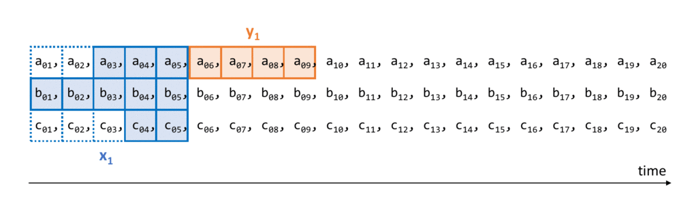

Also in this case the outputs will be two numpy arrays of shapes respectively `(n_samples, timesteps, n_features) = (12, 5, 3)` and `(n_samples, n_out) = (12, 4)`. The empty window spaces are in this case filled with nan values.

In addition to these two output arrays, a futhermore output is returned: the input sample `X_test` for predicting the 4 points ahead in the future not present in the dataset (in this case [2018-09-11, 2018-09-12, 2018-09-13, 2018-09-14]):

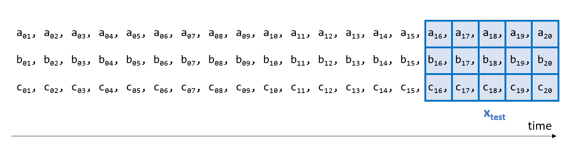

where, in this example, we have set `lags_dictionary = {"A": 5, "B": 5, "C": 5}`.

The algorithm works also for static time-series, in this case the values to set in the input dictionary of lags is 0. For example, supposing that the time-series `B` is static, you have to pass the dictionary `lags_dictionary = {"A": 5, "B": 0, "C": 5}`. In this case, it is equivalent to set the lag as the maximum value, i.e. 5. Furthermore, if you decide to not insert a feature lag in the dictionary that feature is automatically discarded during the process to create samples.

Using the parameter `validation = True`, we automatically discard the last 4 points to use for validation in the following manner:

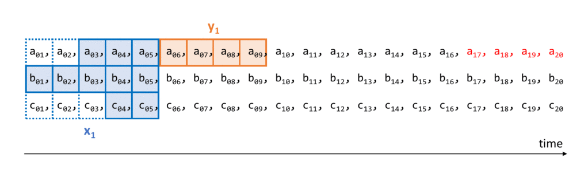

where we have set `lags_dictionary = {"A": 3, "B": 0, "C": 2}`. As you can see, we have created a set of training points  and a validation set .

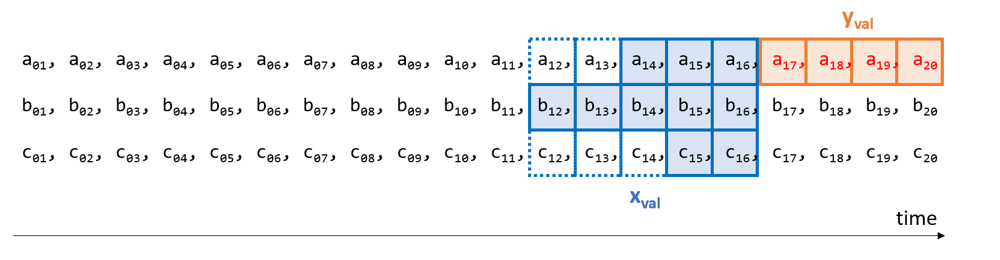

As an alternative to the direct approach there is an approach that we call `single_step` where each prediction horizon is predicted independently of the others. So, setting `single_step = True`, and supposing we want to predict the 2-th of 4 prediction horizons, we will have the following steps:

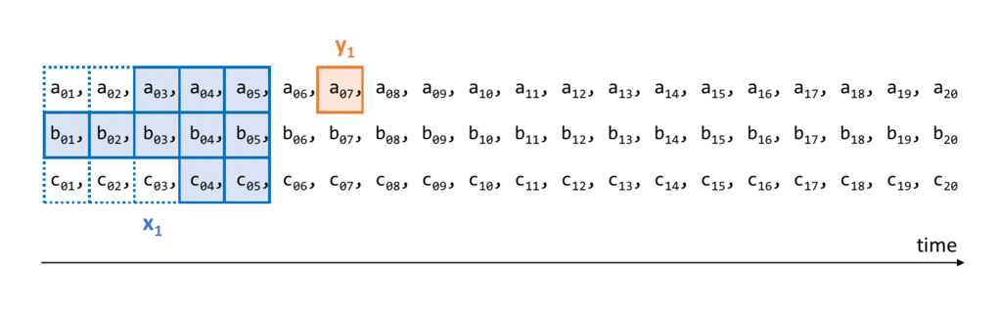

where we have set `lags_dictionary = {"A": 3, "B": 0, "C": 2}`. The procedure is similar for the other prediction horizons. If we set the `validation = True` parameter, we will have as outputs: 

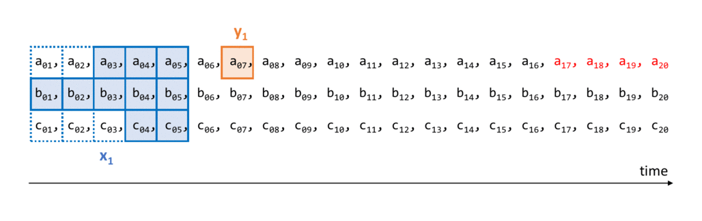

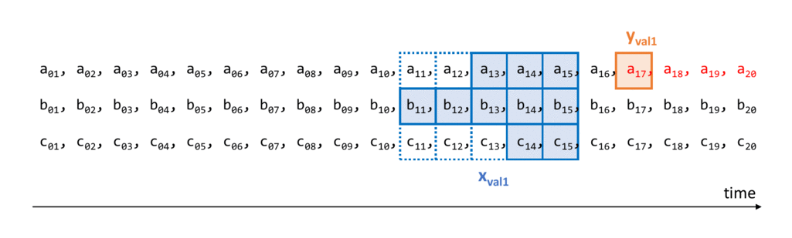

A last possible configuration is regarding the format of the outputs. So far the returned outputs we talked about are numpy arrays. Now, setting the parameter `return_dataframe = True`, `single_step = False`, `lags_dictionary = {"A": 3, "B": 0, "C": 2}` and without validation:

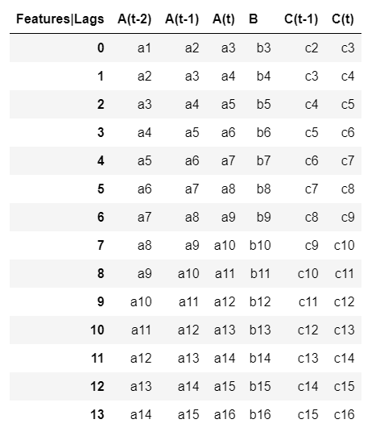

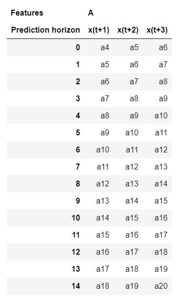

As you can see, in this modality the static feature is managed to kept a single value at each training point (the rows of the output dataframe).