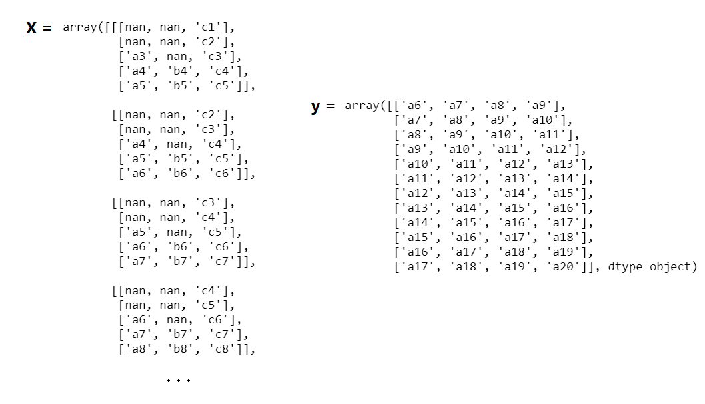

# Lags-Creator

This module allows us to create training/validation/test lag-features samples for time-series forecasting purposes. The module supports different configurations to get the outputs into several formats. In order to correctly use this module, it is necessary to have a pandas dataframe `df` with 2-level hierarchical indices on axis 1: the level 0 corresponding to a single main group and the level 1 corresponding to the time-series. For example, let's take the following dataframe `df`:

N.B. The dataframe `df` need to have a pandas datetime index with an appropriate frequency set.

In order to better understand the functionality of the current module, let's flip the dataframe for explanation purposes only:

In this case, we have three features (time-series), `A`, `B` and `C`. Supposing we would like to predict 4 steps ahead in the future for the time-series `A`. The time-series `A` is therefore defined as our `target` feature. 

We can forecast multiple steps (e.g. 4 steps in the future) into a single-shot through a *direct approach* (in practice, we set `single_step = False` during the initialization of the Lags-Creator class). Now, we have to create lag-features for each time-series present in the dataframe. We then provide to the module the `lags_dictionary` parameter. It is a python dictionary containing the lag values for each time-series. 

E.g., setting the `lags_dictionary = {"A": 5, "B": 5, "C": 5}`, we create the following training points:

At the end of the iteration, we will have a set of training points: . 

We can also modify the `lags_dictionary` parameter setting lags values differently from feature to feature. For example, setting `lags_dictionary = {"A": 3, "B": 5, "C": 2}`:

The algorithm works also for static time-series, in this case the value to set in the input dictionary is 0. For example, supposing that the time-series `B` is static, you have to pass the dictionary `lags_dictionary = {"A": 5, "B": 0, "C": 2}`. Furthermore, if you decide to insert a None feature lag in the dictionary, the feature corresponding to that value is automatically discarded during the process for creating samples.

By default (`return_dataframe = False`, `row_output = False`), the module returns two numpy arrays `X` and `y` as training output of shapes respectively `(n_samples, timesteps, n_features)` and `(n_samples, n_out)`. if `lags_dictionary = {"A": 3, "B": 2, "C": 5}`, `X` has shape `(12, 5, 3)` and `y` has shape `(12, 4)`. The empty window spaces are in this case filled with nan values:

You can change the output format through the parameter `row_output = True`. In this case each training sample is flatten over an unique row to get the shapes `X`: `(12, 10)` and `y`: `(12, 4)`:

As you can see, using this modality the nan values are deleted. Another difference using `row_output = True` despite to not use it, is regarding the management of static features. For example, if `row_output = False` and `lags_dictionary = {"A": 5, "B": 0, "C": 2}`, the output is equivalent to set the lag of the time-series `B` as the maximum value in the dictionary, i.e. 5. In the `row_output = True` case, it is kept an unique lag value for the static time-series.

Another configuration to set (only if you are working in the `row_output = True` modality), is through the `return_dataframe = True` parameter. In this case, the output format is returned as a pandas dataframe:

As an alternative to the direct approach there is an approach that we call `single_step` where each prediction horizon is predicted independently of the others. So, setting `single_step = True`, and supposing we want to predict the 2-th of 4 prediction horizons, we will have the following steps:

where we have set `lags_dictionary = {"A": 3, "B": 5, "C": 2}`. The procedure is similar for the other prediction horizons.

## Visualization

The LagsCreator module also provide a visualization function in order to better examine the samples created. Supposing to use the example dataframe `df` and we create the following samples using the `lags_dictionary = {"A": 3, "B": 0, "C": 2}`:

    creator = LagsCreator(df, lags_dict, "A", n_out = 4, return_dataframe = False, row_output = False, feature_time = False, single_step = True)
    X_train, y_train = creator.to_supervised(h = 2)
                                                                   
Now, we can visualize the samples created using the `visualization` function:

    train = creator.visualization(boundaries = False)
    
If you want to see the 6-th training sample, we get it through the variable `train[5]`: 

