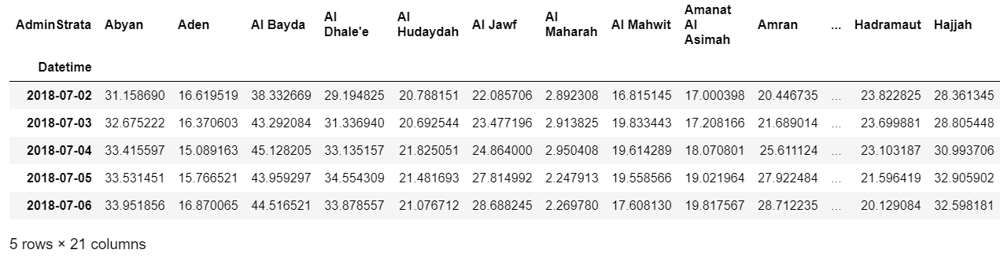
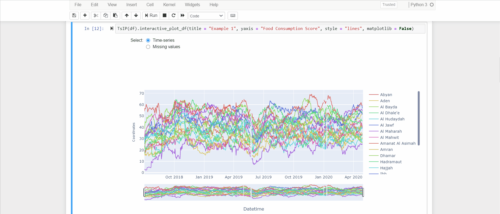

# TsIP

**TsIP** (Time-series Interactive Plot) is a python library developed to interactively visualize multiple time-series quickly and easily. 
The implementation of this tool responds to the need to visualize time-series stored into a pandas dataframe with hierarchical multi-index on axis 1, taking advantage of dynamic user interaction.
The time-series are plotted using either the *matplotlib* library or the *plotly* library (user will). For a more involving navigation within the time-series visualization, it is advice to use the plotly library rather than the matplotlib library.  

## Examples

1. Supposing to have a simple dataframe `df` with a single level on axis 1 (we show only the first 5 rows):

Using the TsIP library, we can easily visualize all the time-series with a simple command:

N.B. If `matplotlib = False`, the time-series are visualized using the plotly library which as you can see is much more engaging.  